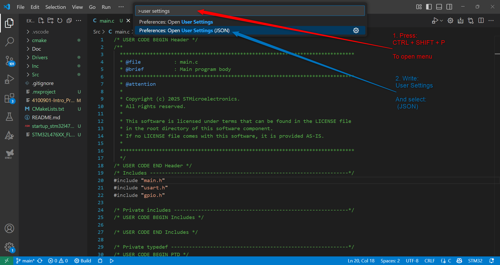
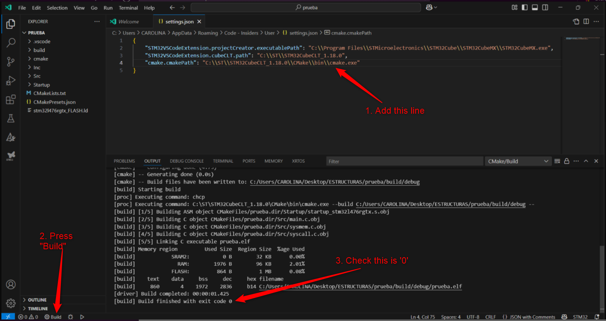

# Cómo solucionar el error de CMake en VS Code

Si al compilar un proyecto STM32 en VS Code obtienes un error similar a:

```
Bad CMake executable: "". Check to make sure it is installed or the value of the "cmake.cmakePath" setting contains the correct path
```

O al intentar compilar recibes:

```
[main] Building folder: proyecto
[rollbar] Unhandled exception: Unhandled Promise rejection: build Error: Build failed: Unable to configure the project {}
```

Este problema ocurre porque VS Code no encuentra el ejecutable de CMake.

Puedes solucionarlo fácilmente siguiendo estos pasos:

## Solución: Agregar la ruta de CMake en la configuración de VS Code

1. **Abre la configuración JSON de VS Code:**
   - Presiona `Ctrl + Shift + P`.
   - Escribe `User Settings`.
   - Selecciona `Preferences: Open User Settings (JSON)`.

   

2. **Añade la siguiente línea** indicando la ruta exacta donde tienes instalado `cmake.exe`:

```json
"cmake.cmakePath": "C:\\ST\\STM32CubeCLT_1.18.0\\CMake\\bin\\cmake.exe"
```

> **Nota:** Cambia la ruta (`C:\ST\STM32CubeCLT_1.18.0`) según la ubicación exacta de tu instalación.

3. **Guarda el archivo**.

4. **Construye el proyecto nuevamente** presionando el botón `Build` en la barra inferior de VS Code:

5. **Verifica que el resultado de compilación muestre:**

```
Build finished with exit code 0
```



Esto indica que tu configuración es correcta y que el proyecto se compiló exitosamente.

¡Listo! Ahora puedes continuar con tu proyecto STM32 sin problemas.

